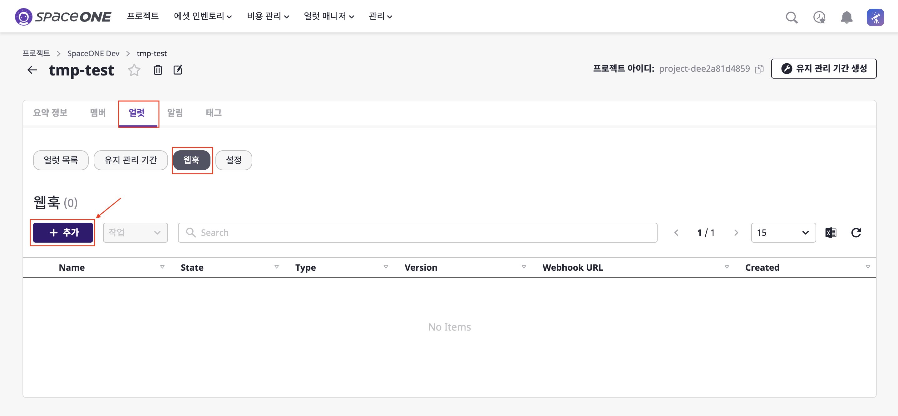
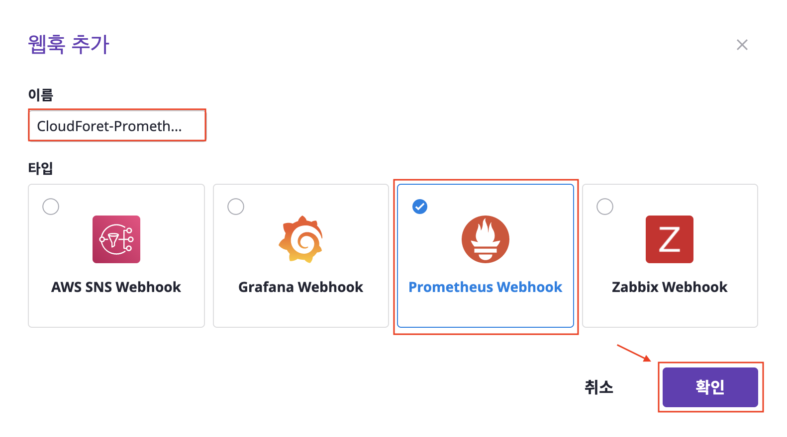
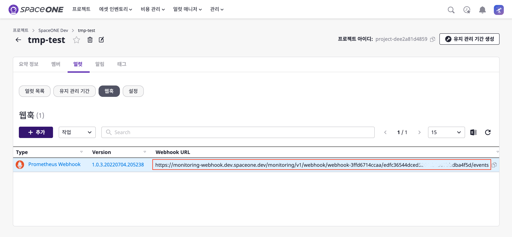
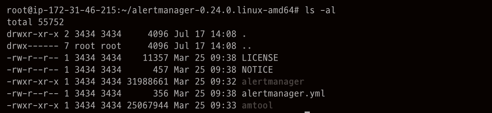

## 개요

클라우드포레는 Prometheus와 연동하기 위해 Prometheus Webhook을 제공하고 있습니다.  
본 가이드는 Prometheus에서 보내는 Alert을 클라우드포레로 수신하기 위한 설정 방법을 안내 합니다.  
설정 방법은 아래와 같은 순서로 수행합니다.

[1. Prometheus Webhook 설정(클라우드포레)](./GUIDE.md/#1-prometheus-webhook-설정)  
[2. Prometheus Alert manager 설정(Prometheus)](./GUIDE.md/#2-prometheus-alert-manager-설정)

Prometheus는 타 서비스와 연동하기 위해 alert manager라는 기능을 제공하며,  
이 alert manager에 클라우드포레의 Webhook URL을 명세하여 Prometheus에서 발생하는 Alert을 클라우드포레로 전송이 가능합니다.

<br>
<br>

## 1. Prometheus Webhook 설정

클라우드포레에서 Prometheus Webhook을 생성하면 Webhook URL을 획득할 수 있습니다.  
다음 단계를 통해 알아보도록 하겠습니다.

(1) 클라우드포레의 특정 프로젝트에서 [얼럿]을 클릭 합니다.  
&nbsp;&nbsp;&nbsp;&nbsp;&nbsp;[웹훅] 버튼을 클릭하면 현재 생성된 웹훅 목록을 볼 수 있습니다.  
&nbsp;&nbsp;&nbsp;&nbsp;&nbsp;[+ 추가] 버튼을 클릭하여 새로운 Prometheus Webhook을 생성합니다.



(2) 모달이 열리면 [이름]을 기입하고 [Prometheus Webhook]을 선택 후 [확인] 버튼을 클릭 합니다.



(3) 생성된 Prometheus Webhook을 확인할 수 있습니다.  
&nbsp;&nbsp;&nbsp;&nbsp;&nbsp;`webhook URL`은 Prometheus와 연동을 위해 사용됩니다.



<br>
<br>

## 2. Prometheus Alert manager 설정

Prometheus의 Alert manager는 Prometheus서버에서 만들어진 Alert을 클라우드포레로 전달하는 역할을 하는 서비스로,  
Promethues에서 발생하는 Alert 처리를 위해 prometheus에서 Alert manager를 custom resource 형태로 띄웁니다.

>본 가이드는 Prometheus에 익숙한 사용자를 대상으로 합니다.  
>Prometheus의 Alert manager 설정에 대한 자세한 내용은 [Alerting Configuration Document](https://prometheus.io/docs/alerting/latest/configuration/) 를 참고 하십시오.  
>Prometheus가 Prometheus-operator helm 차트에서 제공되는 경우 [여기](https://github.com/prometheus-operator/prometheus-operator/blob/main/Documentation/user-guides/alerting.md) 에서 Alert manager를 구성할 수 있습니다.

이제 기본 설정에 대해 알아 보겠습니다.

(1) 서버에 alert manager를 설치하면 아래와 같이 파일을 확인할 수 있습니다.  
&nbsp;&nbsp;&nbsp;&nbsp;&nbsp;설정파일에 해당하는 `alertmanger.yml` 을 열어 수정합니다.



(2) [1. Prometheus Webhook 설정(클라우드포레)](./GUIDE.md/#1-prometheus-webhook-설정)에서 획득한 `webhookURL`을 기입 합니다.  
&nbsp;&nbsp;&nbsp;&nbsp;&nbsp;inhibit_rules는 사용자 임의로 Alert을 발생시킬 rule을 설정할 수 있습니다.

```markdown
route:
  group_by: ['job']
  group_wait: 1m
  group_interval: 5s
  repeat_interval: 2m
  receiver: 'cloudforet-alertmanager-webhook'
receivers:
  - name: 'cloudforet-alertmanager-webhook'
    webhook_configs:
      - url: 'https://monitoring-webhook.dev.spaceone.dev/monitoring/v1/webhook/webhook-3ffd6714ccaa/edfc36544dced5264cb2507xxxxxxxxx/events'
inhibit_rules:
  - source_match:
      severity: 'critical'
    target_match:
      severity: 'warning'
    equal: ['alertname', 'dev', 'instance']
```

이제, Alert manager가 설치된 서버에서 발생하는 Alert을 클라우드포레에서 수신할 수 있습니다.